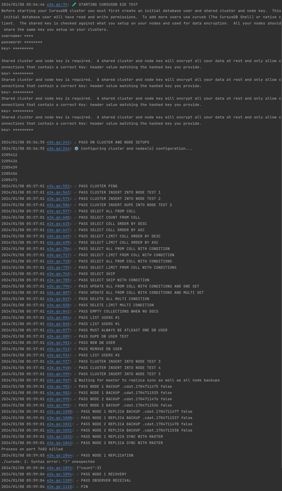

## CursusDB E2E(End to end) Test
This custom E2E test goes through majority of systems functionality, simple as that!

The test will create a cluster with 2 nodes and 1 replica for each node.  The main nodes are configured to sync every minute, backup every minute and relay to test Observer.  All nodes are configured to log as well as cluster.  We test main node recovery, the entire CDQL language and scenarios.  Then clean up after the test is complete if passed.

## What's missing
What's missing could possibly be added but you can definitely manual test the automatic backup cleanup and ANYTHING with TLS(we could put it in this test)

## Running
Make sure you have GO, Node.JS and BASH
``` 
go run .
```

