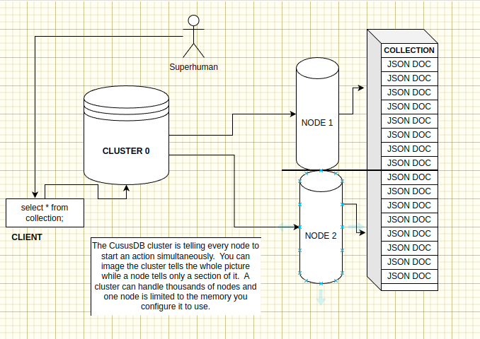
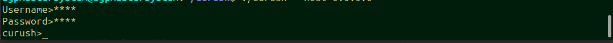

## Cursus Database System
CursusDB is a blazing fast open source in-memory document type database offering security, distribution, and an SQL like query language.

https://cursusdb.com/documentation

The idea behind CursusDB was to create something unlimitedly scalable whilst never really slowing down. Say you have 10 million documents stored on 100 nodes the cluster will query 1 billion documents in the time it takes to query 10 million. This is the power of parallel search. The Cursus system is searching say in the users collection in multiple sections of the collection simultaneously.

### Features
- Secured cluster and node(s) communication with shared key and OR TLS.
- Encrypted data at rest by default with chacha20poly1305.
- In-memory data during runtime
- Parallel search.  Searching collections within multiple nodes simultaneously.
- Database Users with basic (R, RW) permissions
- Cluster and node authentication.
- JSON object insert.
- Cluster and client authentication.
- Unique values across all nodes based on key using "key!" on insert.
- SQL like query language (CDQL - Cursus Document Query Language)
- Super low-latency
- Unique k:v across all nodes using exclamation at end of key name ``email!``
- Secure by default with shared key and users
- Highly configurable
- User permissions ``RW`` ``R``
- Lightweight core code under 4,000 lines of code in total
- Logging and automatic log truncation based on ``log-max-lines`` config



## Cluster & Node Building & Initial Setup
Getting started with CursusDB is extremely easy!  First you  must build a cluster and node binary.  To do that clone the source and follow below:

You must make sure you have GO installed minimum version 1.21.3, once installed follow below.
``` 
git clone git@github.com:cursusdb/cursus.git
cd cluster
go build .
cd ..
cd node 
go build .
```

Now you should have a curode and a cursus binary.


Now with both we first start cursus to setup a database user, .cursusconfig and a shared key which will be used for your node as well.  This key is used to authenticate your cluster and nodes also encrypt your data at rest with ChaCha!


So now that we have our credentials setup we have to setup our first node!

We can run a node on the same instance as a cluster for this example.  After completion of cluster setup through the initial run you'll get a .cursusconfig which has a few configurations.
``` 
nodes: []
tls-node: false
tls-cert: ""
tls-key: ""
tls: false
port: 7681
key: n4bQgYhMfWWaL+qgxVrQFaO/TxsrC4Is0V1sFbDwCgg=
users:
    - DX8EAQL/gAABDAEQAABM/4AAAwh1c2VybmFtZQZzdHJpbmcMBgAEdGVzdAhwYXNzd29yZAZzdHJpbmcMBgAEdGVzdApwZXJtaXNzaW9uBnN0cmluZwwEAAJSVw==

```
- nodes - database cluster nodes.  i.e an ip/fqdn + port combination (cluster1.example.com:7682)
- tls-node - whether the cluster will connect to nodes via tls
- tls-cert - path to your tls cert for cluster
- tls-key - path to your tls key for cluster
- tls - enable or disable tls 
- port - cluster port
- key - encoded shared key
- users - array of database users serialized, and encoded.


Let's put in under nodes a local node we will start shortly.
``` 
nodes: 
    - 0.0.0.0:7682
tls-node: false
tls-cert: ""
tls-key: ""
tls: false
port: 7681
key: n4bQgYhMfWWaL+qgxVrQFaO/TxsrC4Is0V1sFbDwCgg=
users:
    - DX8EAQL/gAABDAEQAABM/4AAAwh1c2VybmFtZQZzdHJpbmcMBgAEdGVzdAhwYXNzd29yZAZzdHJpbmcMBgAEdGVzdApwZXJtaXNzaW9uBnN0cmluZwwEAAJSVw==

```

Now with your .cursusconfig setup let's start our node for the first time.


You'll see that I've added the same key as I did for the cluster and the node is now started! 

Let's start our cluster now.


Look at that!  We are all set to start inserting data.  Let's insert a user document into a users collection with a unique email key value using the curush(CursusDB Shell)

We can use curush with flag ``--host`` which will use the default port for a cluster 7681.  If we wanted to specify a different port we can used the ``--port ``flag.  If your cluster is using TLS make sure when using curush to also enable tls using flag ``--tls=true``.




curush will ask for a database user username and password to connect to cluster.  Once authorized you can start running queries!
``` 
insert into users({"name": "Alex", "lastName": "Padula", "age": 28, "email!": "apadula@cursusdb.com"});
```


On inserts every document will get a unique ``$id `` key which is unique across all nodes.


If we try and insert the same document we will get an error stating an existing document already exists.  This is because we set ``email`` with and ``!`` 


## Query Language
### Inserts
```
insert into users({"name": "Alex", "last": "Lee", "age": 28});
insert into users({"name": "John", "last": "Josh", "age": 28, "tags": ["tag1", "tag2"]});
```

### Selects
```
select * from users;
select 0,2 from users;
select 1 from users where name == 'Alex' || name == 'John';
select * from users where name == 'Alex' && age == 28;
select * from users where tags == "tag1";
select * from users where name == 'Alex' && age == 28 && tags == 'tag1';
```

### Updating
```
update 1 in users where age >= 28 set name = 'Josie';
update * in users where age > 24 && name == 'Alex' set name = 'Josie', age = 52;
update n, n..
ect..
```

### Deleting
```
delete * from users where age >= 28 || age < 32;
delete 0,5 from users where age > 28 && name == 'Alex';
ect
```

### Uniqueness
using ``key!`` will make sure the value is unique across all nodes!
``` 
insert into users({"email!": "test@example.com" ...});
```

### Database Users
CursusDB has 2 permissions R(read) and (RW).  RW can select, insert, delete, update and add new users whereas users with just R can only read.

``` 
new user USERNAME, PASSWORD, P
```

Using a client like ``curush`` the CursusDB Shell Program.

``` 
curush> new user someusername, somepassword, RW;
```

#### Removing Database Users
``` 
delete user USERNAME;
```

### Operators
- ``>``
- ``>=``
- ``<``
- ``>=``
- ``==``
- ``!=``

### Conditionals
- ``&&``
- ``||``

### Actions
- ``select``
- ``update``
- ``delete``

### Status codes
#### Authentication / Authorization
- ``0`` Authentication successful.
- ``1`` Unable to read authentication header.
- ``2`` Invalid authentication value.
- ``3`` No user exists
- ``4`` User not authorized
#### Document
- ``2000`` Document inserted/updated/deleted
- ``4000`` Unmarsharable JSON insert
- ``4001`` Missing action
- ``4002`` None existent action
- ``4003`` Nested JSON object cannot be inserted
- ``4004`` Document already exists
- ``4005`` Invalid command/query
- ``4006`` From is required
- ``4007`` Invalid query operator
- ``4008`` Set is missing =
- ``4009`` Invalid insert query missing 'insert into'
- ``4010`` Invalid insert query is missing parentheses
- ``4011`` Invalid update query missing set
### Node / Cluster 
- ``500`` - Unknown error (with description)
- ``100`` - Node is at peak allocation.
- ``101`` - Invalid permission.
- ``102`` - User does not exist.
- ``103`` - Database user already exists.
- ``104`` - No node was available for insert.
- ``105`` - Node unavailable
- ``200`` - New database user created successfully.
- ``201`` - Database user removed successfully.

### Ports
Default cluster port: ``7681``
Default node port: ``7682``

## Logging 
Logs for the CursusDB cluster and node are found where you launch your binaries.
Cluster: ``cursus.log``
Node: ``curode.log``

Within your yaml configs you can set ``log-max-lines`` this option will tell either node or cluster when to truncate(clear up) the log file(s).

### How are logs are formatted?
[LEVEL][UTC DATETIME] DATA

Logs can have either level:
- ERROR
- INFO
- FATAL
- WARN

``` 
[INFO][2023-12-09 05:28:36.119141987 +0000 UTC] Log truncated at 1000
[INFO][2023-12-09 05:28:36.119159073 +0000 UTC] Collection mutexes created.
[INFO][2023-12-09 05:28:37.115749244 +0000 UTC] Received signal interrupt.  Starting shutdown.
[INFO][2023-12-09 05:28:37.115770678 +0000 UTC] Starting to write node data to file.
[INFO][2023-12-09 05:28:37.115928288 +0000 UTC] WriteToFile(): Node data written to file successfully.

```

#### Example using curush querying cluster
``` 
./curush -host 0.0.0.0
Username> ******
Password> *****
curush>select * from users;

127.0.0.1:7682: [{"$id":"17cc0a83-f78e-4cb2-924f-3a194dedec90","age":28,"last":"Padula","name":"Alex"}]
curush>select * from users;

127.0.0.1:7682: [{"$id":"17cc0a83-f78e-4cb2-924f-3a194dedec90","age":28,"last":"Padula","name":"Alex"}]
curush>insert into users({"name": "Alex", "last": "Lee", "age": 28});

{"insert":{"$id":"ecaaba0f-d130-42c9-81ad-ea6fc3461379","age":28,"last":"Lee","name":"Alex"},"message":"Document inserted","statusCode":2000}
curush>select * from users;

127.0.0.1:7682: [{"$id":"17cc0a83-f78e-4cb2-924f-3a194dedec90","age":28,"last":"Padula","name":"Alex"},{"$id":"ecaaba0f-d130-42c9-81ad-ea6fc3461379","age":28,"last":"Lee","name":"Alex"}]
```

^ Single node

If multiple nodes you'd see a response similar to the one below

```
curush>select * from users;

127.0.0.1:7682: [{"$id":"17cc0a83-f78e-4cb2-924f-3a194dedec90","age":28,"last":"Doe","name":"John"},..]
127.0.0.1:7683: [{"$id":"17cc0a83-f78e-4cb2-924f-3a194dedec91","age":32,"last":"Johnson","name":"Sarah"},..]
127.0.0.1:7684: [{"$id":"17cc0a83-f78e-4cb2-924f-3a194dedec92","age":42,"last":"Stint","name":"Peter"},..]

```

## Todo
- Create backup nodes which when one node becomes unavailable to start at shutting down nodes state replicating and replacing it's position on the clusters(s). This is a peer-2-peer like activity.

### Notes
If you write ``select 1 from users;``  This will select 1 from each node.  Therefore on your backend when calling Cursus, JOIN your results into one result.  If you have 4 nodes and you select 1 well you'll get 4 results if one record matches your query on each node.

A cluster should be public where nodes should be private to the cluster.
A node can have a private IP whereas the cluster has an address that is external and can be reached by outside applications for example
