## Cursus Database System
CursusDB is a fast open source in-memory document oriented database offering security, persistence, distribution, availability and an SQL like query language.

https://cursusdb.com/documentation

The idea behind CursusDB was to create something unlimitedly scalable whilst never really slowing down. Say you have 1 billion documents stored within 1 collection spread across 100 nodes the cluster will query 1 billion documents in the time it takes to query 10 million as the cluster initiates a non insert action on each node simultaneously. This is the power of parallel search. The Cursus system is searching say in the users collection in multiple sections of the collection simultaneously.

### Features
- Secured cluster and node(s) communication with shared key and OR TLS
- If configured secured node sync replication with TLS using ``tls-replication`` config within ``.curodeconfig``
- Encrypted data at rest by default with chacha20poly1305
- In-memory data during runtime
- Parallel search. Searching section of collections within multiple nodes simultaneously at the same time.
- Auto generated $id key for all documents unique across all nodes
- Database Users with basic (R, RW) permissions
- Cluster and node authentication
- Cluster node data replication and synchronization specifically for reads
- JSON object insert
- Unstructured collections
- Cluster and client authentication.
- SQL like query language (CDQL - Cursus Document Query Language)
- Low-latency
- Highly available
- Unique k:v across all nodes using exclamation at end of key name ``email!``
- Secure by default with shared key and users
- Highly configurable
- Lightweight core code under 4,500 lines of code in total
- File logging and automatic log truncation based on ``log-max-lines`` config
- Automatic reconnect of any lost node or node replica
- Automatic node backups if ``automatic-backup`` within ``.curodeconfig`` is set to true
- Automatic node backup clean up if ``automatic-backup-cleanup`` within ``.curodeconfig`` is set to true.  ``automatic-backup-cleanup-time`` is in days.
- Automatic node recovery if data is corrupt if ``automatic-backup`` configured

**There are no databases like MySQL let's say where you can have multiples.  A cluster is your database that spreads data across many nodes.**

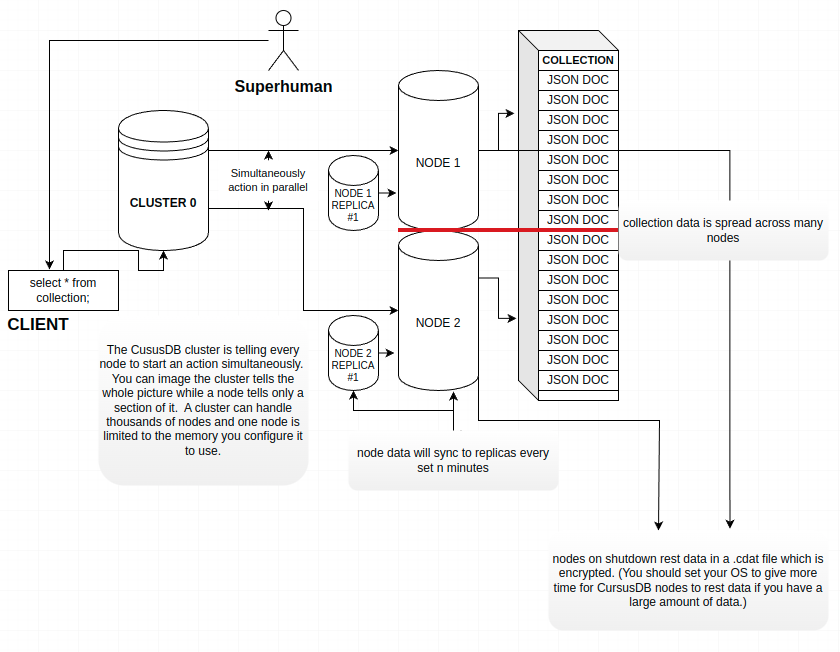


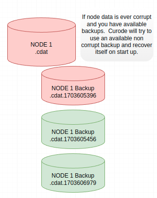

## Docker
https://hub.docker.com/repositories/cursusdb

## Cluster & Node Building & Initial Setup
Getting started with CursusDB is extremely easy!  First you  must build a cluster and node binary.  To do that clone the source and follow below:

You must make sure you have GO installed minimum version 1.21.3, once installed follow below.
``` 
git clone git@github.com:cursusdb/cursusdb.git
cd cluster
go build .
cd ..
cd node 
go build .
```

Now you should have a curode and a cursus binary.

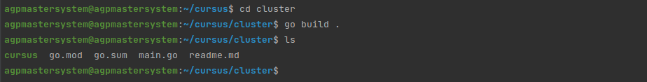

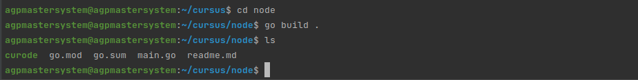

Now with both we first start cursus to setup a database user, .cursusconfig and a shared key which will be used for your node as well.  This key is used to authenticate your cluster and nodes also encrypt your data at rest with ChaCha!

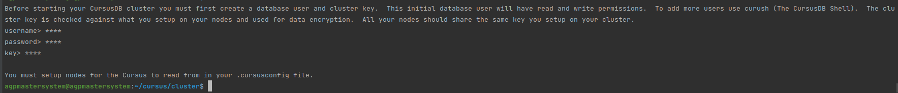

So now that we have our credentials setup we have to setup our first node!

We can run a node on the same instance as a cluster for this example.  After completion of cluster setup through the initial run you'll get a .cursusconfig which has a few configurations.
``` 
nodes: []
host: 0.0.0.0
tls-node: false
tls-cert: ""
tls-key: ""
tls: false
port: 7681
key: QyjlGfs+AMjvqJd/ovUUA1mBZ3yEq72y8xBQw94a96k=
users:
    - YWxleA==:7V8VGHNwVTVC7EktlWS8V3kS/xkLvRg/oODmOeIukDY=
node-reader-size: 2097152
log-max-lines: 1000
join-responses: false
logging: false
timezone: Local
```
- nodes - database cluster nodes.  i.e an ip/fqdn + port combination (cluster1.example.com:7682)
- tls-node - whether the cluster will connect to nodes via tls
- tls-cert - path to your tls cert for cluster
- tls-key - path to your tls key for cluster
- tls - enable or disable tls 
- port - cluster port
- key - encoded shared key
- users - array of database users serialized, and encoded.
- node-reader-size - the max size of a response from a node
- join-responses - join all node responses and limit based on provided n
- logging - start logging to file

Let's put in under nodes a local node we will start shortly.
``` 
nodes:
- host: 0.0.0.0
  port: 7682
```

Now with your .cursusconfig setup let's start our node for the first time.

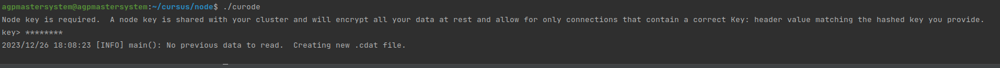

You'll see that I've added the same key as I did for the cluster and the node is now started! 

Let's start our cluster now.


Look at that!  We are all set to start inserting data.  Let's insert a user document into a users collection with a unique email key value using the curush(CursusDB Shell)

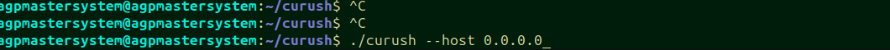

We can use curush with flag ``--host`` which will use the default port for a cluster 7681.  If we wanted to specify a different port we can used the ``--port ``flag.  If your cluster is using TLS make sure when using curush to also enable tls using flag ``--tls=true``.


curush will ask for a database user username and password to connect to cluster.  Once authorized you can start running queries!
``` 
insert into users({"name": "Alex", "lastName": "Padula", "age": 28, "email!": "apadula@cursusdb.com"});
```
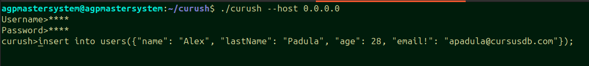

On inserts every document will get a unique ``$id `` key which is unique across all nodes.

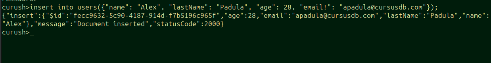

If we try and insert the same document we will get an error stating an existing document already exists.  This is because we set ``email`` with and ``!`` 
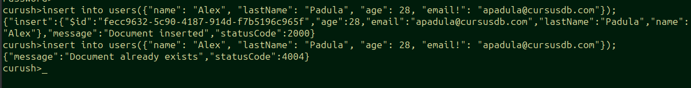

## Node Replicating
.cursusconfig
```
nodes:
- host: 0.0.0.0
  port: 7682
  replicas:
  - host: 0.0.0.0
    port: 7683
..
```

Node at ``0.0.0.0:7682`` has a configured replica at ``0.0.0.0:7682``

On the nodes end you need to configure a replica so the node you're configuring knows to replicate the data over.

.curodeconfig
``` 
replicas:
  - host: 0.0.0.0
    port: 7683
tls-cert: ""
tls-key: ""
..
```

Default sync time is 10 minutes and can be configured with yaml config ``replication-sync-time`` the node will sync its data to its configured replicas.
If original node shuts down or is not available a replica will be used for reads, if a replica is not available another available replica will be used(a node can configure multiple replicas).

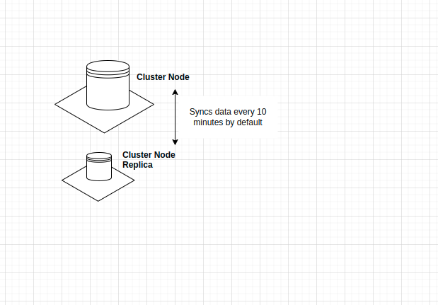

## Ping the cluster
Using curush or native client

```
> ping;
> pong;
```


## Query Language
Case-sensitive.. Keep it lowercase as the example.

### Inserts
```
insert into users({"name": "Alex", "last": "Lee", "age": 28});
insert into users({"name": "John", "last": "Josh", "age": 28, "tags": ["tag1", "tag2"]});
```

### Selects
```
select {LIMIT} from {COLLECTION} where {CONDITIONS} {ORDERING}
select * from users;
select 0,2 from users;
select 1 from users where name == 'Alex' || name == 'John';
select * from users where name == 'Alex' && age == 28;
select * from users where tags == "tag1";
select * from users where name == 'Alex' && age == 28 && tags == 'tag1';
```

##### NOTE
You can use ``==`` OR ``=``

For example 
``` 
select 1 from users where name == 'Alex' || name == 'John';
```

OR
``` 
select 1 from users where name = 'Alex' || name = 'John';
```


### Updating
```
update {LIMIT} in {COLLECTION} where {CONDITIONS} {SETS} {ORDERING}
update 1 in users where age >= 28 set name = 'Josie' order by createdAt desc;
update * in users where age > 24 && name == 'Alex' set name = 'Josie' set age = 52;
update n, n..
ect..
```

### Deleting
```
delete {LIMIT} from {COLLECTION} where {CONDITIONS} {ORDERING}
delete * from users where age >= 28 || age < 32;
delete 0,5 from users where age > 28 && name == 'Alex';
ect
```

### Pattern Matching
#### LIKE
Starts with 'A'
``` 
select * from users where firstName like 'A%lex Padula'
```

Ends with 'la'
``` 
select * from users where firstName like 'Alex Padu%la'
```

Contains Pad
``` 
select * from users where firstName like 'Alex %Pad%ula'
```

#### NOT LIKE
Starts with 'A'
``` 
select * from users where firstName not like 'A%lex Padula'
```

Ends with 'la'
``` 
select * from users where firstName not like 'Alex Padu%la'
```

Contains Pad
``` 
select * from users where firstName not like 'Alex %Pad%ula'
```

### Sorting
``` 
select * from users order by createdOn desc;
```

``` 
select * from users order by firstName asc;
```

### Counting
Example
``` 
select count from users where $id == "099ade86-93a8-4703-abdd-d1ccc1078b1d";
```

Response not joined
``` 
[{"127.0.0.1:7682": [{"count":1}]}]
```

Response joined if each node has 1 match and there is 5 nodes
``` 
{"count":5} 
```

### Uniqueness
using ``key!`` will make sure the value is unique across all nodes!
``` 
insert into users({"email!": "test@example.com" ...});
```

### Database Users
CursusDB has 2 permissions R(read) and (RW).  RW can select, insert, delete, update and add new users whereas users with just R can only read.

``` 
new user USERNAME, PASSWORD, P
```

Using a client like ``curush`` the CursusDB Shell Program.

``` 
curush> new user someusername, somepassword, RW;
```

#### Listing Database Users

Getting all database users.  User with RW permission required.

```
list users;
```

command returns JSON array of database users. 
``` 
["alex","daniel"]
```

#### Removing Database Users
``` 
delete user USERNAME;
```

### Operators
- ``>``
- ``>=``
- ``<``
- ``>=``
- ``==``
- ``=``
- ``!=``

### Conditionals
- ``&&``
- ``||``

### Actions
- ``select``
- ``update``
- ``delete``

### Status codes
#### Authentication / Authorization
- ``0`` Authentication successful.
- ``1`` Unable to read authentication header.
- ``2`` Invalid authentication value.
- ``3`` No user exists
- ``4`` User not authorized
- ``5`` Failed node sync auth
#### Node / Cluster
- ``100`` - Node is at peak allocation
- ``101`` - Invalid permission
- ``102`` - User does not exist
- ``103`` - Database user already exists
- ``104`` - No node was available for insert
- ``105`` - Node unavailable
- ``106`` - Node ready for sync
- ``107`` - Node replica synced successfully
- ``108`` - Could not decode serialized sync data into hashmap
- ``200`` - New database user created successfully
- ``201`` - Database user removed successfully
- ``202`` - Could not decode user username
- ``203`` - Could not marshal users list array
- ``204`` - There must always be one database user available
- ``205`` - Could not marshal user for creation
- ``206`` - Could not get node working directory for automatic backup (with description)
- ``207`` - Could not create automatic backups directory (with description)
- ``208`` - Could not read node backups directory  (with description)
- ``209`` - Could not remove .cdat backup {FILE NAME} (with description)
- ``210`` - Could not get node working directory for automatic recovery (with description)
- ``211`` - Node data backup was successful
- ``500`` - Unknown error (with description)
- ``501`` - Limit skip must be an integer (with description)
- ``502`` - Could not convert limit value to integer (with description)
- ``503`` - Invalid limiting slice value (with description)
- ``504`` - Invalid limiting value (with description)
- ``505`` - Key cannot use reserved word
- ``506`` - Where is missing values
#### Document
- ``2000`` Document inserted/updated/deleted
- ``4000`` Unmarsharable JSON insert
- ``4001`` Missing action
- ``4002`` None existent action
- ``4003`` Nested JSON objects not permitted
- ``4004`` Document already exists
- ``4005`` Invalid command/query
- ``4006`` From is required
- ``4007`` Invalid query operator
- ``4008`` Set is missing =
- ``4009`` Invalid insert query missing 'insert into'
- ``4010`` Invalid insert query is missing parentheses
- ``4011`` Invalid update query missing set
- ``4012`` Could not marshal JSON
- ``4013`` Unparsable boolean value
- ``4014`` Unparsable float value
- ``4015`` Unparsable int value
- ``4016`` Missing limit value
- ``4017`` Invalid query operator
- ``4018`` Unmarsharable JSON
- ``4019`` Update sets are missing

### Ports
Default cluster port: ``7681``
Default node port: ``7682``

## Logging 
Logs for the CursusDB cluster and node are found where you launch your binaries.
Cluster: ``cursus.log``
Node: ``curode.log``

You can enable logging on either cluster or node enabling logging.  This will log to file instead of stdout
``` 
logging: true
```

Within your yaml configs you can set ``log-max-lines`` this option will tell either node or cluster when to truncate(clear up) the log file(s).

### How are logs are formatted?
[LEVEL][YOUR CONFIGURED TZ RFC822 DATE] DATA

Logs can have either level:
- ERROR
- INFO
- FATAL
- WARN

``` 
[INFO][26 Dec 23 08:34 EST] main(): Node data read into memory.
[INFO][26 Dec 23 08:34 EST] main(): Collection mutexes created.
[INFO][26 Dec 23 08:34 EST] SignalListener(): Received signal interrupt starting database shutdown.
[INFO][26 Dec 23 08:34 EST] WriteToFile(): Starting to write node data to file.
[INFO][26 Dec 23 08:34 EST] WriteToFile(): Node data written to file successfully.
```

#### Example using curush querying cluster
``` 
./curush -host 0.0.0.0
Username> ******
Password> *****
curush>select * from users;

127.0.0.1:7682: [{"$id":"17cc0a83-f78e-4cb2-924f-3a194dedec90","age":28,"last":"Padula","name":"Alex"}]
curush>select * from users;

127.0.0.1:7682: [{"$id":"17cc0a83-f78e-4cb2-924f-3a194dedec90","age":28,"last":"Padula","name":"Alex"}]
curush>insert into users({"name": "Alex", "last": "Lee", "age": 28});

{"insert":{"$id":"ecaaba0f-d130-42c9-81ad-ea6fc3461379","age":28,"last":"Lee","name":"Alex"},"message":"Document inserted","statusCode":2000}
curush>select * from users;

127.0.0.1:7682: [{"$id":"17cc0a83-f78e-4cb2-924f-3a194dedec90","age":28,"last":"Padula","name":"Alex"},{"$id":"ecaaba0f-d130-42c9-81ad-ea6fc3461379","age":28,"last":"Lee","name":"Alex"}]
```

^ Single node

If multiple nodes you'd see a response similar to the one below

```
curush>select * from users;

127.0.0.1:7682: [{"$id":"17cc0a83-f78e-4cb2-924f-3a194dedec90","age":28,"last":"Doe","name":"John"},..]
127.0.0.1:7683: [{"$id":"17cc0a83-f78e-4cb2-924f-3a194dedec91","age":32,"last":"Johnson","name":"Sarah"},..]
127.0.0.1:7684: [{"$id":"17cc0a83-f78e-4cb2-924f-3a194dedec92","age":42,"last":"Stint","name":"Peter"},..]

```

By default though you wont see above..
``` 
join-responses: false
```

is required to see results for each node.


``join-responses`` joins all documents from nodes and limits based on limit.  For example..

``` 
select 3 from posts order by createdOn desc;
```

The ``select 3`` portion the cluster will get depending on set amount of nodes say you have 5 nodes setup, you will get back 3 * 5 but the cluster will limit to 3 as that what was requested!


## Cluster to Node TLS connectivity & Node to Node replica TLS connectivity 
If you set ``tls-node`` on the cluster to true the cluster will expect all nodes to be listening on tls.

If you set ``tls-replication`` on a cluster node to true the cluster node will expect all node replicas to be listening on tls.

## Issues 
Please report issues, enhancements, etc at:
- https://github.com/cursusdb/cursusdb/discussions
- https://github.com/cursusdb/cursusdb/issues


## Todo
- Allow SQL inserts ```insert into coll (key, key!, key!, ...)
  VALUES (value1, value2, value3, ...); ``` (Possible enhancement)

## CursusDB v MySQL BENCHMARK
Most basic setup.  CursusDB cluster and node hosted same instance no TLS.
MySQL setup exact same specification of an instance no TLS.

### CursusDB
```Connection time: 64ms```

Inserting 1002 records sequentially

```insert into users({"first": "James", "last": "Jones", "age": 22, "active": true});```

```Insertion time: 33928 ms```

Read skipping 1000 selecting 1 where first is James

```select 1000,1 from users where first == "James";```

``Read time: 32ms``


### MySQL
``Connection time: 170ms``

Inserting 1002 records sequentially

```INSERT INTO users (first, last, age, active) VALUES ("James", "Jones", 22, true);```

```Insertion time: 38234ms```

Read skipping 1000 selecting 1 where first is James

```SELECT * FROM users where first = "James" LIMIT 1 OFFSET 1000;```


``Read time: 44ms``

Table used

``CREATE TABLE users (
first varchar(255),
last varchar(255),
age int,
active BOOLEAN
);``
